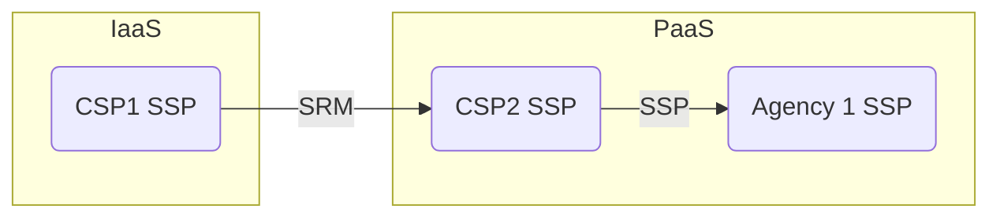
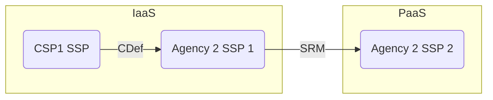

# Example Scenarios

> Note: The source diagram is located [here](https://github.com/usnistgov/OSCAL/issues/2012#issuecomment-2250898533)

## Scope

IaaS and PaaS Cloud Service Providers

*Not explored here - Responsibility at the statement level*

## Diagram Subset 1

- OSCAL SSP x3
- OSCAL SRM

## Diagram Subset 2

- OSCAL SSP x3
- OSCAL SRM
- OSCAL Component Definitions

