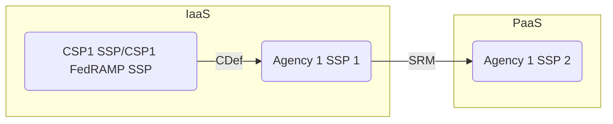
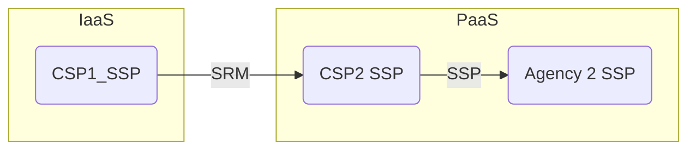

# Example Scenarios

> Note: The source diagram is located [here](https://github.com/usnistgov/OSCAL/issues/2012#issuecomment-2250898533)

## Diagram Subset Left Side

**Persona** Infrastructure Deployer
**Use Case** Agency1 with two different systems. One is leveraging another.

- OSCAL SSP x3
- OSCAL SRM
- OSCAL Component Definition

## Diagram Subset Right Side

**Persona** Infrastructure User and Platform Deployer
**Use Case** A PaaS is leveraging an IaaS authorization

- OSCAL SSP x3
- OSCAL SRM

